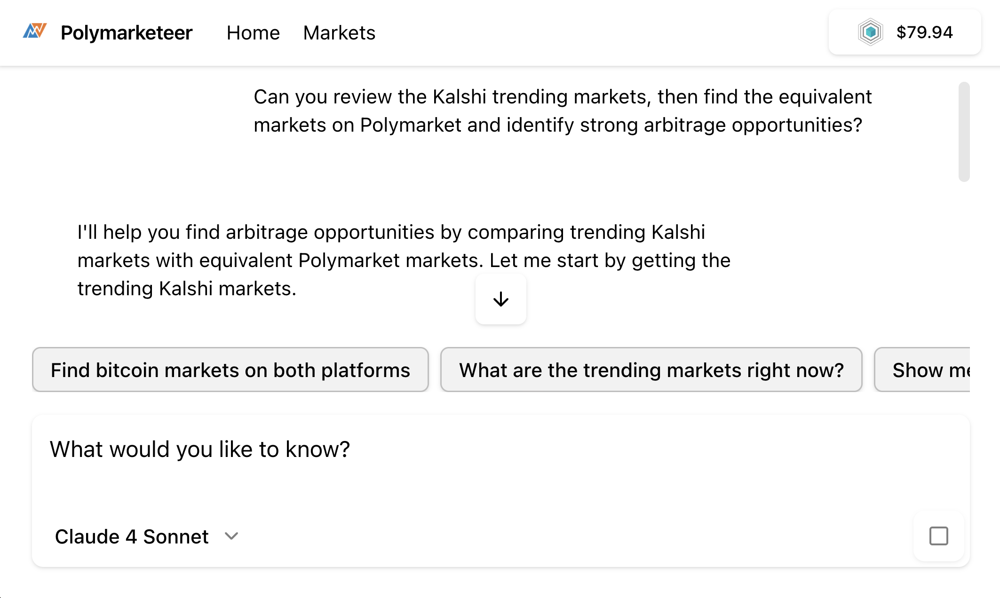

# Polymarketeer

AI-powered prediction market discovery tool for Polymarket and Kalshi.



**[Try it live →](https://polymarketeer.vercel.app)**

## Features

- **AI Market Search** - Natural language queries across both platforms
- **Trending Markets** - Real-time data from Polymarket and Kalshi APIs
- **Market Analysis** - Compare markets, odds, and volume across platforms
- **Multi-Model Support** - Choose between GPT-4o, GPT-5, or Claude Sonnet

## Getting Started

```bash
# Install dependencies
pnpm install

# Run development server
pnpm dev
```

Open [http://localhost:3000](http://localhost:3000)

### Configure Echo

1. Create an app at [echo.merit.systems](https://echo.merit.systems)
2. Add your App ID to `src/echo/index.ts`

---

 Made with [**Echo**](https://echo.merit.systems) - SDK for user-pays AI apps
